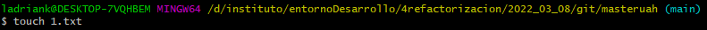
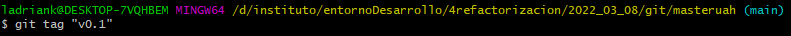
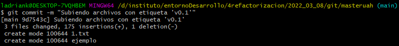
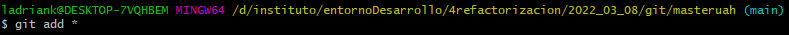

# GITHUB ACTIVIDAD
## Clonar Repositorio

``git clone https://github.com/ladriank-education/masteruah``   

## Crear/Modificar README.md
> Marqué la creación automatica del fichero **README.md** a la hora de crear el repositorio

## Primer Commit
> Como no tengo ningun nuevo cambio en el repositorio primero creare un fichero.
> Para ello, usare el siguiente comando:

``touch fichero``   

> Posteriormente lo agregare al 'Staging Area' con el uso del siguiente comando:

``git add fichero``   

> Ahora si puedo ejecutar un commit mediante el siguiente comando:

``git commit -m "Commit Inicial"``

## Subiendo archivos
> Para subir los archivos al repositorio he usado el siguiente comando:

``git push``

## Crear fichero '1.txt' en el repositorio local
> Para crear un fichero volvemos a usar el comando:

``touch 1.txt``

## Crear etiqueta 'v0.1'
> Creamos la etiqueta con el nombre **'v0.1'**
> Esto hace que los ficheros que vayamos a incluir en el commit tengan la etiqueta designada

``git tag "v0.1"``

## Subir etiqueta 'v0.1'
> Para subir la etiqueta tan solo debemos ejecutar el siguiente comando, aunque no es recomendado

``git push --tags``

## Crear rama 'v0.2'
> Usamos el comando sentenciado a continuacion para crear una rama.

``git branch 'v0.2'``

## Crear fichero '1.txt' en la rama 'v0.2'

> Para crear un archivo en otra rama primero debemos movernos a la rama en cuestion.

``git checkout 'v0.2'``

> Ya que estamos en la rama, nos disponemos a crear el archivo

