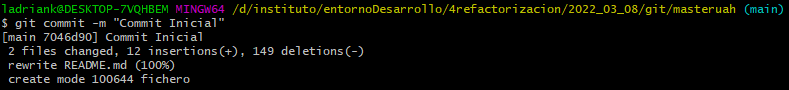
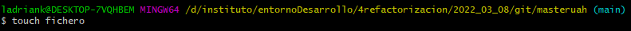
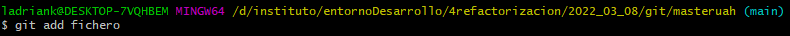
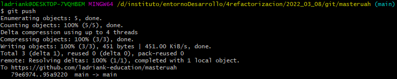

# GITHUB ACTIVIDAD
## Clonar Repositorio
>`git clone https://github.com/ladriank-education/masteruah`
## Crear/Modificar README.md
> Marqué la creación del fichero README.md a la hora de crear el repositorio
## Primer Commit
> Como no tengo ningun nuevo cambio en el repositorio primero creare un fichero.
> Para ello, usare el siguiente comando:
>>`touch fichero`

> Posteriormente lo agregare al 'Staging Area' con el uso del siguiente comando:
>>`git add fichero`

> Ahora si puedo ejecutar un commit mediante el siguiente comando:
>>`git commit -m "Commit Inicial"`

## Subiendo archivos
> Para subir los archivos al repositorio he usado el siguiente comando:
>>`git push`

